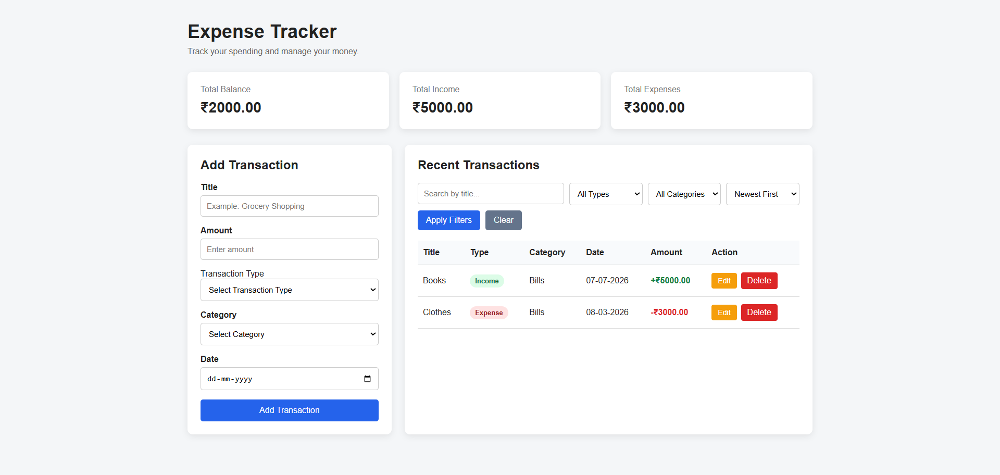

# Expense Tracker

A full-stack Expense Tracker web application built with Flask and SQLite. The application allows users to manage income and expenses, view financial summaries, search and filter transactions, sort records, and perform complete CRUD operations through a responsive web interface.

## Live Demo

The application is deployed online and can be accessed here:

**Live Application:**
https://expense-tracker-flask-0we9.onrender.com/

## Application Preview

## Features

- Add income and expense transactions
- View total balance, total income, and total expenses
- Edit existing transactions
- Delete transactions with confirmation
- Persistent transaction storage using SQLite
- Search transactions by title
- Filter transactions by type and category
- Sort transactions by date and amount
- Backend validation for submitted data
- Success and error flash messages
- Responsive user interface
- Income and expense badges
- Automatic financial summary calculations
- Empty-state and filtered-results messages

## Tech Stack

- Python
- Flask
- SQLite
- HTML5
- CSS3
- Jinja2
- Gunicorn
- Git
- GitHub

## Project Structure

    expense-tracker-flask/
    |
    |-- static/
    |   |-- css/
    |   |   `-- style.css
    |   |
    |   `-- js/
    |       `-- script.js
    |
    |-- templates/
    |   |-- index.html
    |   `-- edit.html
    |
    |-- .gitignore
    |-- app.py
    |-- requirements.txt
    |-- wsgi.py
    `-- README.md

## Installation and Setup

### 1. Clone the Repository

    git clone https://github.com/pronay7777/expense-tracker-flask.git

    cd expense-tracker-flask

### 2. Create a Virtual Environment

Windows:

    python -m venv venv

Activate the virtual environment:

    .\venv\Scripts\Activate.ps1

macOS/Linux:

    python3 -m venv venv

    source venv/bin/activate

### 3. Install Dependencies

    pip install -r requirements.txt

### 4. Run the Application

    python app.py

Open your browser and visit the local address displayed in the terminal.

## How to Use

1. Enter a transaction title and amount.
2. Select Income or Expense.
3. Select a transaction category.
4. Choose a date.
5. Click Add Transaction.
6. Use Edit to update an existing transaction.
7. Use Delete to remove a transaction.
8. Use search, filters, and sorting to find and organize transactions.
9. View automatically calculated financial summaries at the top of the dashboard.

## Database

The application uses SQLite for local data persistence.

The database is automatically created when the application starts for the first time.

The local database file is excluded from version control through `.gitignore`.

## Security and Validation

- Server-side validation of transaction data
- Parameterized SQLite queries
- Whitelisted sorting options
- POST requests for state-changing operations
- Environment-variable support for the Flask secret key
- Delete confirmation before removing transactions

## Deployment

The application is deployed as a Python web service.

Production configuration:

- Hosting Platform: render
- Production Server: Gunicorn
- WSGI Entry Point: 'wsgi.py'
- Start Command: 'gunicorn wsgi:app'
- Environment variable support for the Flask secret key

### Deployment Note

The current deployed version users SQLite. On the free hosting instance, local filesystem data may not persist across service restarts or redeployments.

A production-ready future version can use PostgreSQL for persistent cloud database storage.

## Future Improvements

- User registration and login
- Separate transaction data for each user
- Monthly budgets
- Expense analytics and charts
- CSV and PDF report export
- Pagination
- Recurring transactions
- Automated tests
- REST API endpoints
- PostgreSQL support for production deployment

## Author

Pronay Mondal

B.Tech Computer Science and Engineering Student

## License

This project is created for learning, portfolio development, and educational purposes.